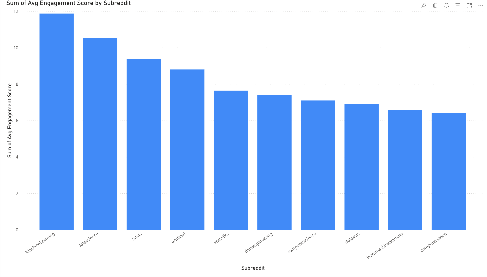
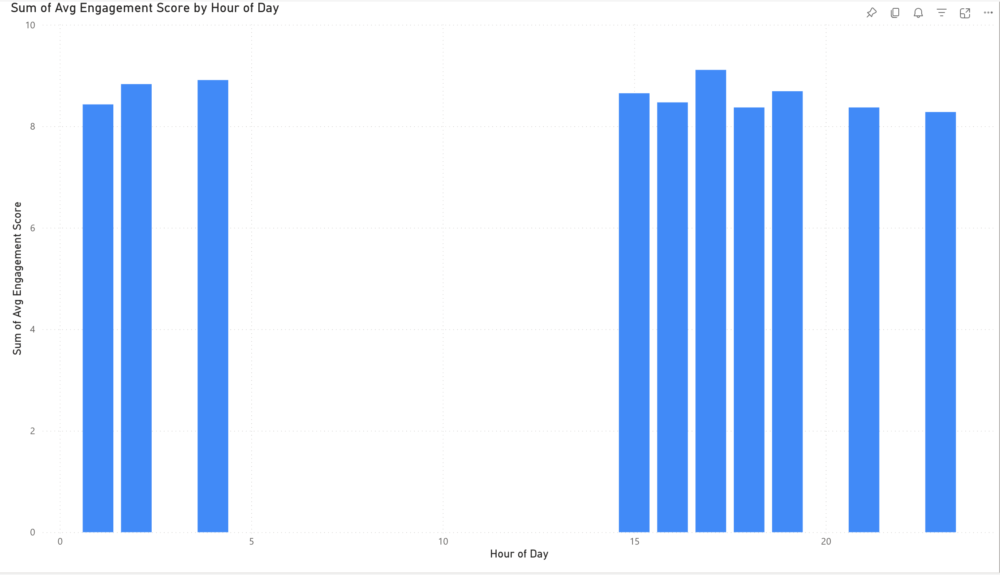
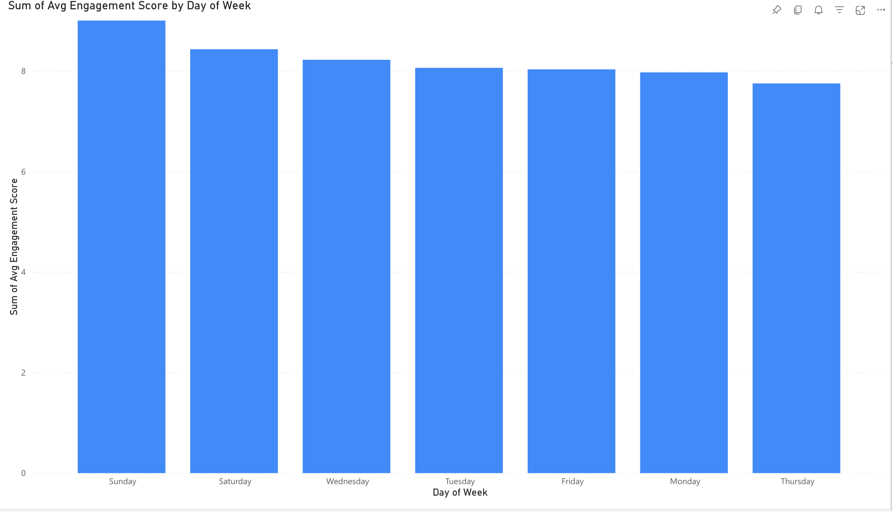
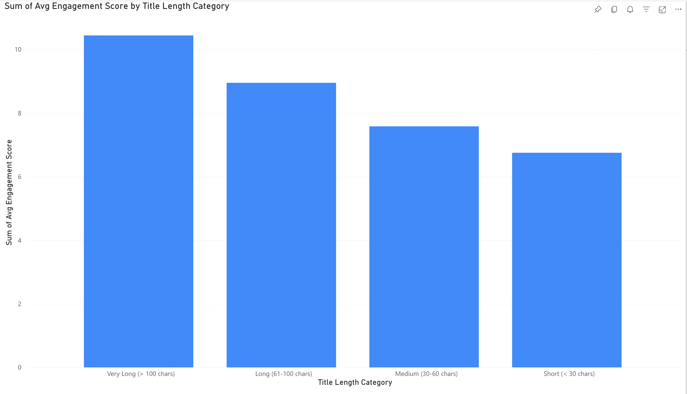

# Reddit Startups Content Analysis

An end-to-end data analytics project analyzing **545,000+ Reddit posts** to identify engagement patterns across startup, data, and technology communities.

This project focuses on **real-world analytical challenges** such as messy data, engagement metric design, and interpretation limitations, and translates findings into **actionable content strategy recommendations**.

---

## Business Problem

Content teams, founders, and community managers often struggle to answer:

- Where should we post for maximum engagement?
- When should we post to increase visibility?
- What content characteristics influence engagement?

This project uses large-scale Reddit data to provide **data-driven insights** into these questions.

---

## Dataset

- Source: Public Reddit dataset (Kaggle)
- Total Records (Raw): 545,427 posts
- Records After Cleaning: 479,156 posts

---

## Tools & Technologies

- **Python** (Pandas, NumPy) — data cleaning and feature engineering
- **SQL (SQLite)** — analytical queries
- **Power BI** — dashboard and visualization
- **Jupyter Notebook** — exploratory analysis

---

## Data Cleaning & Preparation

- Removed duplicate records
- Filtered deleted, removed, and bot-generated posts where applicable
- Handled inconsistent or invalid comment values
- Converted timestamps into datetime format
- Engineered new features:
  - Posting hour
  - Day of week
  - Title length
- Created derived analytical datasets for SQL analysis and dashboarding

---

## Methodology

### Engagement Metric Definition

To measure post performance, an engagement score was defined as:

**Engagement Score = Upvotes + (2 × Number of Comments)**

**Rationale:**
- Comments represent deeper user interaction than upvotes
- Comments were weighted more heavily to reflect stronger engagement quality rather than surface-level visibility

**Note:**
Alternative approaches such as normalization by subreddit size or log-scaled engagement were considered but not implemented in this version of the analysis.

Sensitivity analysis on alternative weightings (e.g., 1.5x, 3x) was not performed and may affect results.

---

## Business Questions

1. Which subreddits generate the highest engagement per post?
2. What posting times are associated with stronger engagement?
3. Do certain days of the week perform better than others?
4. Is there a relationship between title length and engagement?

---

## Key Insights (With Analytical Considerations)

### 1. Subreddit Engagement Distribution
- Smaller niche subreddits often showed higher average engagement per post
- Larger subreddits generated higher total engagement volume but lower average engagement per individual post

**Interpretation:**  
Engagement is not driven purely by audience size; community behavior and content expectations vary significantly across subreddits.

### 2. Posting Time Patterns
- Higher engagement was observed during **late afternoon to evening hours, approximately 4 PM to 8 PM**

**Limitation:**  
- Post timestamps reflect creation time, not necessarily the audience’s local timezone
- Observed patterns may be influenced by the dominant geographic distribution of Reddit users

### 3. Day-of-Week Trends
- Weekend posting, especially on **Saturday and Sunday**, showed slightly higher engagement on average

**Caution:**  
- The difference is moderate rather than extreme
- This may reflect higher user activity levels rather than stronger content quality alone

### 4. Title Length vs Engagement
- Longer titles were associated with higher average engagement

**Critical Note:**  
- This relationship is correlational, not causal
- Longer titles may be more common in certain post types such as storytelling, advice, or detailed problem descriptions

Further validation would be required before using title length alone as a strict content optimization rule.

---

## Limitations

- This analysis is based on observational data rather than controlled experimentation
- Engagement metrics may be influenced by viral outliers
- Time-based analysis does not account for differences in user timezone
- Subreddit audiences vary significantly in behavior, size, and posting norms
- Title length findings are correlational and should not be interpreted as causal

These limitations should be considered before applying the findings directly to business decisions.

---

## Business Recommendations

Based on the analysis, the following actions are recommended for startup content teams and community-focused brands:

### 1. Refine Posting Strategy
- Prioritize posting during late afternoon to evening hours
- Test weekend versus weekday performance within specific subreddit communities rather than assuming a universal posting rule

### 2. Target Communities Strategically
- Use niche subreddits when the goal is higher engagement per post
- Use larger subreddits when the goal is broader reach and visibility

### 3. Improve Content Framing
- Use descriptive, context-rich titles where appropriate
- Align title style and tone with the norms of each target subreddit instead of optimizing purely for length

### 4. Validate Before Scaling
- Run A/B tests on title structure and posting windows
- Normalize engagement by subreddit size in future analysis
- Re-test findings after excluding extreme viral outliers to confirm robustness

---

## Project Structure

    reddit-startups-content-analysis/
    │
    ├── data/
    │   └── cleaned/
    │       ├── subreddit_engagement.csv
    │       ├── hourly_engagement.csv
    │       ├── daily_engagement.csv
    │       └── title_length_engagement.csv
    │
    ├── notebooks/
    │   └── data_cleaning_and_eda.ipynb
    │
    ├── sql/
    │   └── reddit_engagement_analysis.sql
    │
    ├── images/
    │   ├── top_subreddits_dashboard.png
    │   ├── best_hours_dashboard.png
    │   ├── best_days_dashboard.png
    │   └── title_length_dashboard.png
    │
    ├── requirements.txt
    └── README.md

---

## Dashboard

The Power BI dashboard visualizes:

- Engagement by subreddit
- Engagement by posting hour
- Engagement by day of week
- Title length vs engagement

### Top Subreddits by Engagement

### Best Hours to Post

### Best Days to Post

### Title Length Impact on Engagement

---

## Conclusion

This project demonstrates how large-scale, messy social data can be transformed into actionable insights.

More importantly, it highlights the importance of:

- careful metric design
- critical interpretation of results
- understanding analytical limitations

Future work would include statistical testing and normalization by subreddit size.

---

## Author

Satya Seetha Sankeerthana Mulukutla  
MS Computer Science — University of Central Missouri  
GitHub: https://github.com/sankeerthana22

